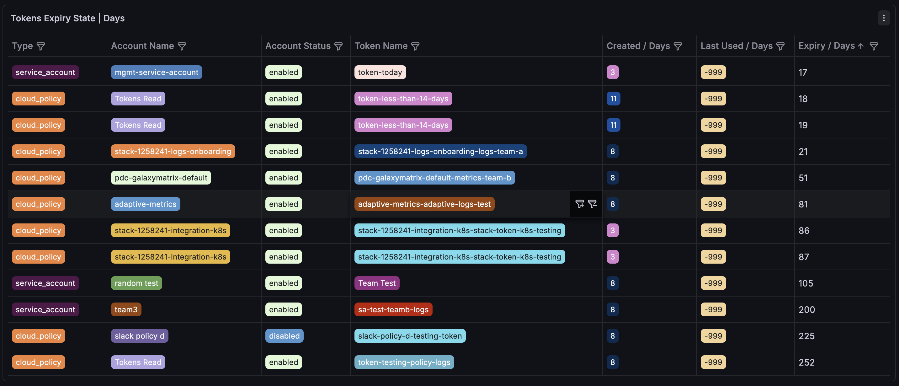
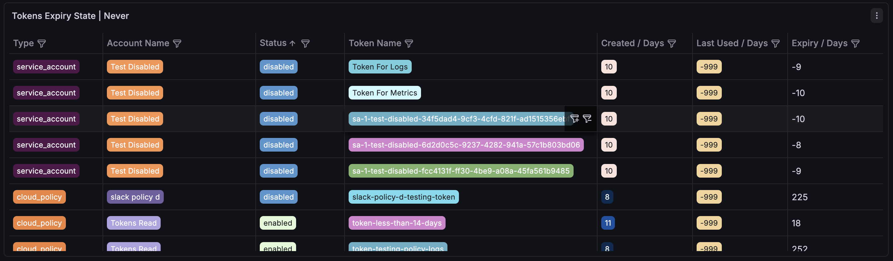

# Grafana Token Monitor

A set of scripts that monitor token expiration for **Grafana service accounts** and **Grafana Cloud access policies**. When tokens are approaching expiry (or already expired), the tooling sends OTLP metrics to Grafana Cloud and Slack notifications to a configured channel.

## Architecture

```
tokens/
├── bash/
│   ├── tokens_service_accounts.sh   (Grafana Instance API)
│   ├── tokens_cloud_policies.sh     (Grafana Cloud API)
│   ├── tokens_metrics.sh            (OTLP push)
│   ├── tokens_slack.sh              (Slack alert)
│   └── functions.sh                 (shared utilities)
└── python/
    ├── tokens_monitor.py            (all-in-one Python version)
    └── requirements.txt

vault/
└── config.cfg                       (credentials & configuration)
```

There are two independent approaches to run the monitor — pick one:

| Approach | Entry point | Description |
|----------|-------------|-------------|
| **Bash** | `tokens/bash/tokens_service_accounts.sh` + `tokens/bash/tokens_cloud_policies.sh` | Each script collects tokens of its type and delegates to `tokens_metrics.sh` and `tokens_slack.sh`. |
| **Python** | `tokens/python/tokens_monitor.py` | Single script that fetches both token types and pushes OTLP metrics (no Slack yet). |

## Files

### `tokens/bash/tokens_service_accounts.sh`

Fetches all service accounts from the Grafana Instance API (paginated), retrieves each account's tokens, and forwards the collected entries to `tokens_metrics.sh` and `tokens_slack.sh`.

- Skips Grafana-managed service accounts (names starting with `extsvc-`).
- Marks each account as `enabled` or `disabled` based on `isDisabled`.
- **API used:** `GET {CLOUD_INSTANCE_URL}/api/serviceaccounts/search` and `GET {CLOUD_INSTANCE_URL}/api/serviceaccounts/{id}/tokens`.

### `tokens/bash/tokens_cloud_policies.sh`

Fetches access policies and their associated tokens from the Grafana Cloud API, then forwards the results to `tokens_metrics.sh` and `tokens_slack.sh`.

- Matches tokens to policies via `accessPolicyId`.
- Uses `displayName` (falling back to `name`) for the policy label.
- **API used:** `GET {CLOUD_API_POLICIES}` (access policies) and `GET {CLOUD_API_TOKENS}` (cloud tokens).

### `tokens/bash/tokens_metrics.sh`

Receives token entries from a caller script and pushes a `grafana_token` gauge metric to the OTLP endpoint via HTTP/JSON.

```
Usage: tokens_metrics.sh <type> <entry1> [entry2] ...
       type  = "service_account" | "cloud_policy"
       entry = "account_name|status|token_name|expiration|created|lastused"
```

Each data point includes these attributes/labels:

| Attribute | Description |
|-----------|-------------|
| `type` | `service_account` or `cloud_policy` |
| `account_name` | Name of the service account or cloud policy |
| `token_name` | Name of the individual token |
| `status` | `enabled` or `disabled` |
| `expiry_state` | `days` (has expiration), `never` (no expiration set), or `unknown` (date parse failed) |
| `created` | Age of the token in **days** since creation (0 if created less than 24 hours ago) |
| `lastused` | Number of **days** since the token was last used (0 if used less than 24 hours ago, `-999` if the token has never been used) |

The gauge value is the number of **days until expiration**:

- Positive values indicate days remaining before the token expires.
- Negative values indicate the token has already expired (e.g. `-3` means expired 3 days ago).
- **`-999`** is a sentinel value used for tokens that are set to **never expire** (`expiry_state: never`). This allows easy filtering in Grafana dashboards.

The `created` and `lastused` labels use integer division by 86 400 seconds, so any duration shorter than 24 hours is reported as `0`.

#### Grafana Dashboard Panel Examples

**Tokens Expiry State — Days** — tokens with an expiration date; the gauge shows days until (or since) expiry:



**Tokens Expiry State — Never** — tokens set to never expire; shown with the `-999` sentinel value:



### `tokens/bash/tokens_slack.sh`

Receives token entries from a caller script and sends a formatted Slack notification listing tokens that have an expiration date.

```
Usage: tokens_slack.sh <type> <entry1> [entry2] ...
       type  = "service_account" | "cloud_policy"
       entry = "account_name|status|token_name|expiration|created|lastused"
```

Severity indicators in the Slack message:

| Condition | Icon |
|-----------|------|
| Already expired | :red_circle: **EXPIRED** |
| 0–3 days left | :red_circle: |
| 4–7 days left | :warning: |
| 8+ days left | :large_yellow_circle: |

Long messages are automatically split into multiple Slack Block Kit sections to stay within the 3000-character limit.

### `tokens/python/tokens_monitor.py`

A self-contained Python replacement that combines the logic of the bash scripts. It fetches both service account tokens and cloud policy tokens, then pushes OTLP metrics — all in a single run.

- **Service accounts:** `{CLOUD_INSTANCE_URL}/api/serviceaccounts/search` (paginated), then `{CLOUD_INSTANCE_URL}/api/serviceaccounts/{id}/tokens` for each. Skips Grafana-managed accounts (`extsvc-*`).
- **Cloud policies:** `grafana.com/api/v1/accesspolicies` and `grafana.com/api/v1/tokens` (matched by `accessPolicyId`).
- **OTLP:** Sends `grafana_token` gauge to `OTLP_ENDPOINT` with basic auth (`OTLP_INSTANCE_ID:OTLP_TOKEN`).

```
python3 tokens/python/tokens_monitor.py
```

Requires the `requests` library (see `tokens/python/requirements.txt`).

### `tokens/bash/functions.sh`

Shared utility functions sourced by the bash scripts:

- **`to_epoch`** — Converts an ISO 8601 date string to a Unix epoch timestamp. Normalizes by stripping trailing `Z` and `+00:00`/`-00:00` offsets (treats as UTC). Handles both macOS `date -jf` and GNU `date -d`.
- **`floor_days`** — Converts a difference in seconds to whole days (floors toward negative infinity for negative values).

### `vault/config.cfg`

Central configuration file sourced by all scripts. Create `vault/config.cfg` with the variables below (or copy from `vault/config.cfg.example` if available).

| Variable | Purpose |
|----------|---------|
| `CLOUD_INSTANCE_URL` | Grafana Cloud instance base URL |
| `CLOUD_INSTANCE_TOKEN` | Grafana service account token with `serviceaccounts:read` scope |
| `CLOUD_API` | Grafana Cloud API base URL (`https://grafana.com/api/v1`) |
| `CLOUD_API_TOKEN` | Grafana Cloud token with `accesspolicies:read` scope |
| `CLOUD_REGION` | Grafana Cloud stack region |
| `CLOUD_STACK_ID` | Grafana Cloud stack identifier |
| `CLOUD_API_POLICIES` | Derived URL for fetching access policies |
| `CLOUD_API_TOKENS` | Derived URL for fetching cloud tokens |
| `OTLP_ENDPOINT` | OTLP HTTP endpoint for metrics ingestion |
| `OTLP_INSTANCE_ID` | Instance ID for OTLP basic auth |
| `OTLP_TOKEN` | Token for OTLP basic auth (`metrics:write` scope) |
| `SLACK_TOKEN` | Slack bot token with `chat:write` scope |
| `SLACK_CHANNEL_ID` | Target Slack channel for notifications |

> **Security note:** `config.cfg` contains secrets (API tokens, Slack token). Ensure it is not committed to public repositories and is properly secured.

## Prerequisites

- **bash** (4.x+), **curl**, **jq**
- **Python 3.10+** and `requests` (for `tokens_monitor.py`)
- Grafana service account token with `serviceaccounts:read` and `serviceaccounts.permissions:read` scopes
- Grafana Cloud API token with `accesspolicies:read` scope
- OTLP write token with `metrics:write` scope
- Slack bot token with `chat:write` scope

## Usage

### Bash — run both monitors

```bash
# Monitor service account tokens
bash tokens/bash/tokens_service_accounts.sh

# Monitor cloud policy tokens
bash tokens/bash/tokens_cloud_policies.sh
```

### Python — single command

```bash
pip install -r tokens/python/requirements.txt
python3 tokens/python/tokens_monitor.py
```

### Scheduled execution

Consider using a serverless or CI/CD scheduled job (e.g. Azure Functions Timer Trigger, 
GitHub Actions scheduled workflow, or GitLab CI/CD scheduled pipeline).
